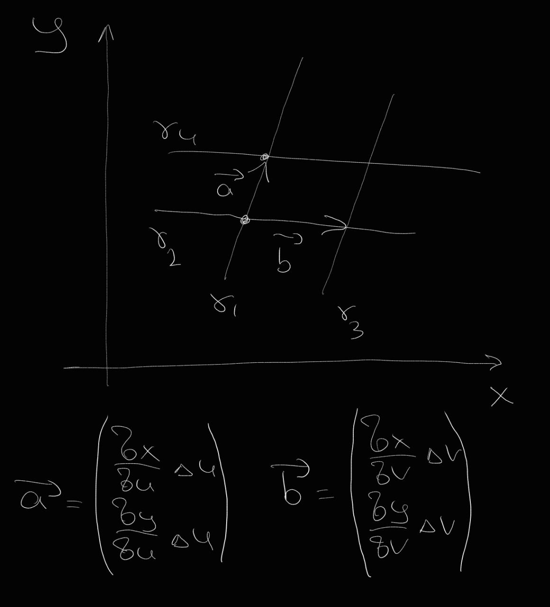

В данной теме я хочу пробежаться и придать немного геометрической интуиции по некоторым аспектам математического анализа.

Иногда будем ссылаться на одномерный анализ, чтобы утверждения были понятнее.

## Понятие производной и ее геометрический смысл

Предположим, у нас есть функция
\[
f: \mathbb{R}^m \to \mathbb{R}.
\]

Постараемся, как и для одномерного случая, определить значение производной.

Рассмотрим изменение по одной из осей \(\mathbb{R}^m\). Обозначим ее за \(x_1\).

\[
f(x, x_2, x_3, \dots, x_m) = f_1(x).
\]

Так как остальные значения я зафиксировал, получается функция \(f_1: \mathbb{R} \to \mathbb{R}\). Посмотрим на ее производную:

\[
f_1(x + \Delta x) = f_1(x) + f_1'(x) \cdot \Delta x + o(|\Delta x|).
\]

Введем обозначение:

\[
\frac{\partial f}{\partial x_1} := f_1'(x).
\]

Окей, давайте поймем физический смысл \(\frac{\partial f}{\partial x_1}\). Это линейное приращение по переменной \(x_1\) при ее малых изменениях.

Аналогичную операцию можно провести для любого \(i\).

### I. Касательная плоскость \((f: \mathbb{R}^2 \to \mathbb{R})\)

Рассмотрим график.

Тут изображен график \(x^2 + y^2\) и выбрана точка \)P(1, 2)\(. Я построил два вектора, один из них имеет фиксированную координату по \)y = 2\) и наклон по оси \(x\), равный \(\frac{\partial f}{\partial x}\) — это красная прямая.

Аналогично на графике изображена прямая с фиксированной координатой по \(x = 1\) и наклон по оси \(y\), равный \(\frac{\partial f}{\partial y}\) — синяя прямая.

Можем заметить, что данные вектора лежат на **касательной плоскости**, проведенной к точке \(P\). Это очень классная и приятная конструкция.

*Также интуитивно может быть ясно, что малая окрестность нашей поверхности может быть аппроксимирована с помощью касательной плоскости*!

Вычислим уравнение этой плоскости:
\[
z = f(x, y) + f_x'(x, y) (x - x_0) + f_y'(x, y) (y - y_0).
\]

Давайте напишем равенство, вытекающее из этого факта.

#### I.I Производная

\[
f(x + \Delta x, y + \Delta y) = f(x, y) + (f_x'(x, y), f_y'(x, y)) \cdot \begin{bmatrix} \Delta x \\ \Delta y \end{bmatrix} + o\left(\left|\begin{bmatrix} \Delta x \\ \Delta y \end{bmatrix}\right|\right).
\]

Вот эта штука:

\[
f(x, y) + (f_x'(x, y), f_y'(x, y)) \cdot \begin{bmatrix} \Delta x \\ \Delta y \end{bmatrix}
\]

— это значение \(z\) на касательной плоскости к точке \((x, y)\) в точке \((x + \Delta x, y + \Delta y)\).

---
*Тут я хочу подчеркнуть очень важное замечание. В одномерном случае у нас была аппроксимация функции с помощью прямой, а в двумерном случае мы можем аппроксимировать с помощью плоскости!*

---

#### I.II Важный пример применения аппроксимации \((f: \mathbb{R}^2 \to \mathbb{R})\)

Рассмотрим поверхность, заданную уравнением \( z = f(x, y) \), и предположим, что нам нужно вычислить поверхностный интеграл
\[
I = \iint_S g(x, y, z) \, dS.
\]

##### Аппроксимация поверхности касательной плоскостью

Разобьем интеграл на малые поверхности:
\[
I_{dS} = \iint_{dS} g(x, y, z) \, dS.
\]
Значение функции в точке на поверхности будет почти везде одинаково, поэтому ее можно вынести за скобку:
\[
I_{dS} = g(x_0, y_0, z_0) \iint_{dS} dS.
\]

Поверхность \(dS\) можно аппроксимировать касательной плоскостью. Назовем ее \)Q\(.

##### Вычисление коэффициента масштабирования

Элемент площади поверхности \(Q\) можно выразить через проекцию на плоскость \( Oxy \). Для этого найдем угол между нормалью \( \mathbf{n} \) к поверхности и осью \( Oz \).

Мы знаем, что вектора \((x, 0, x \cdot \frac{\partial f}{\partial x}(x_0, y_0))\) и \((0, y, y \cdot \frac{\partial f}{\partial y}(x_0, y_0))\) лежат в касательной плоскости. Также известно, что они перпендикулярны. Поэтому нормаль мы можем вычислить при помощи их векторного произведения:
\[
\mathbf{n} = \frac{\partial f}{\partial x}(x_0, y_0) \times \frac{\partial f}{\partial y}(x_0, y_0).
\]

Если посчитать косинус по определению:
\[
\cos \theta = \frac{\mathbf{n} \cdot (0, 0, 1)}{|\mathbf{n}|}.
\]

Косинус угла \( \theta \) между нормалью и осью \( Oz \) равен (это вытекает из предыдущей строчки, но расчеты я опустил):
\[
\cos \theta = \frac{1}{\sqrt{1 + \left(\frac{\partial f}{\partial x}\right)^2 + \left(\frac{\partial f}{\partial y}\right)^2}}.
\]

Так как элемент площади поверхности \( dS \) в проекции на плоскость \( Oxy \) дает элемент площади \( dxdy \), учитывая масштабный коэффициент, получаем связь:
\[
dS = \frac{dxdy}{\cos \theta} = \sqrt{1 + f_x'^2 + f_y'^2} \, dxdy.
\]

##### Итоговая замена переменных

Подставляя это выражение в интеграл, получаем его преобразование к интегралу по \( x, y \):
\[
I = \iint_D g(x, y, f(x, y)) \sqrt{1 + f_x'^2 + f_y'^2} \, dxdy.
\]
Таким образом, мы выразили поверхностный интеграл через двойной интеграл по плоскости \( Oxy \).

---

### II. Замена переменных в подынтегральном выражении \((f: \mathbb{R}^2 \to \mathbb{R})\)

Давайте теперь разберемся с заменой переменных в интеграле:
\[
I = \iint_D f(x, y) \, dxdy.
\]

И предположим, что
\[
x = x(u, v), \quad y = y(u, v).
\]

Тогда:
\[
I = \iint_D f(x, y) \, dxdy = \iint_{\mathbf{\Omega}} G(x(u, v), y(u, v)) \, dudv.
\]

Нам бы хотелось разбить область \(\mathbf{\Omega}\) на маленькие подобласти. Для удобства они будут прямоугольными. И по аналогии с предыдущим разделом аппроксимировать подобласти с помощью плоскостей и далее найти коэффициент отношения площадей подобластей в координатах \((x, y)\) и \((u, v)\).

Мне бы хотелось показать геометрическое соображение:

\[
x = x(u, v), \quad y = y(u, v).
\]

Давайте рассмотрим кривую \(\mathbf{\gamma}: \mathbb{R} \to \mathbb{R}^2\).

Также рассмотрим ее параметризацию \(t\):

\[
\mathbf{\gamma}(t) = \begin{bmatrix} x(t) \\ y(t) \end{bmatrix}.
\]

Тогда:

\[
\mathbf{\gamma}_t' = \begin{bmatrix} x_t'(t) \\ y_t'(t) \end{bmatrix}.
\]

Зафиксируем значение \(t = t_0\):

\[
\mathbf{\gamma}(t_0) = (x_0, y_0).
\]

\(\begin{bmatrix} x_t'(t_0) \\ y_t'(t_0) \end{bmatrix}\) — будет касательным вектором к кривой в координатах \((x, y)\) в точке \(t_0\).

При замене базиса касательный вектор не изменится (фактически расположение точек не изменилось. \(\mathbf{\gamma}\) как лежала в пространстве \(\mathbb{R}^3\), так и лежит). Но изменятся координаты базиса:

\[
\begin{bmatrix} x_t'(t_0) \\ y_t'(t_0) \end{bmatrix} = \begin{bmatrix} x_t'(u(t_0), v(t_0)) \\ y_t'(u(t_0), v(t_0)) \end{bmatrix} = \begin{bmatrix} \frac{\partial x}{\partial u} u_t' + \frac{\partial x}{\partial v} v_t' \\ \frac{\partial y}{\partial u} u_t' + \frac{\partial y}{\partial v} v_t' \end{bmatrix}.
\]

А в базисе \((u, v)\) это будет выглядеть так:
\[
\mathbf{\gamma}_t' = \begin{bmatrix} u_t' \\ v_t' \end{bmatrix}.
\]

Напишем матрицу перехода при смене базиса:

\[
\begin{bmatrix} x(t)' \\ y(t)' \end{bmatrix} = \begin{bmatrix} \frac{\partial x}{\partial u} & \frac{\partial x}{\partial v} \\ \frac{\partial y}{\partial u} & \frac{\partial y}{\partial v} \end{bmatrix} \begin{bmatrix} u(t)' \\ v(t)' \end{bmatrix}.
\]

Матрица
\[
\begin{bmatrix} \frac{\partial x}{\partial u} & \frac{\partial x}{\partial v} \\ \frac{\partial y}{\partial u} & \frac{\partial y}{\partial v} \end{bmatrix}
\]
называется **матрицей Якоби**.

Заметим, что матрица Якоби фиксирована для точки. Получается, что наша формула верна для любого направления касательного вектора (и от \(\mathbf{\gamma}\) выражение тоже не зависит).

Соберем воедино все, что мы получили. Выберем окрестность точки \((u_0, v_0)\). Пусть в данной окрестности матрица Якоби почти не изменяется. Рассмотрим два вектора \((\Delta u, 0)\) и \((0, \Delta v)\).

Построим четыре кривые:

\[
\mathbf{\gamma}_1 = (x(u, v_0), y(u, v_0)), \\
\mathbf{\gamma}_2 = (x(u_0, v), y(u_0, v)), \\
\mathbf{\gamma}_3 = (x(u, v_0 + \Delta v), y(u, v_0 + \Delta v)), \\
\mathbf{\gamma}_4 = (x(u_0 + \Delta u, v), y(u_0 + \Delta u, v)).
\]

Они в пересечении образуют маленький параллелограмм, и его площадь мы можем вычислить. По нашему предположению о том, что матрица Якоби в данной области фиксирована, мы можем вычислить значение векторов в координатах \((x, y)\):

\[
\vec a = \begin{bmatrix} \frac{\partial x}{\partial u} \Delta u \\ \frac{\partial y}{\partial u} \Delta u \end{bmatrix}, \quad \vec b = \begin{bmatrix} \frac{\partial x}{\partial v} \Delta v \\ \frac{\partial y}{\partial v} \Delta v \end{bmatrix}.
\]

Посчитаем площадь, которую они образуют, при помощи векторного произведения \(\vec a \times \vec b\):

\[
\Delta u \Delta v \left| \frac{\partial x}{\partial u} \frac{\partial y}{\partial v} - \frac{\partial y}{\partial u} \frac{\partial x}{\partial v} \right|.
\]

(\(\left| \frac{\partial x}{\partial u} \frac{\partial y}{\partial v} - \frac{\partial y}{\partial u} \frac{\partial x}{\partial v} \right|\) — это определитель матрицы Якоби.)

То есть локально площади при замене переменных будут отличаться на определитель матрицы Якоби.

Напишем финальную формулу:

\[
I = \iint_D f(x, y) \, dxdy = \iint_{\mathbf{\Omega}} f(x(u, v), y(u, v)) \left| \frac{\partial x}{\partial u} \frac{\partial y}{\partial v} - \frac{\partial y}{\partial u} \frac{\partial x}{\partial v} \right| \, dudv.
\]

Наше утверждение про замену переменных можно уточнить для многомерного случая аналогичным образом.

Хочу добавить, что комбинируя апроксимацию функции касательной плоскостью и касательных векторов, можно очень легко понимать множетсво равенств, связанных с заменной перемнных в интеграле или сведение интегралов по многомерной поверхности к множественному интегралу